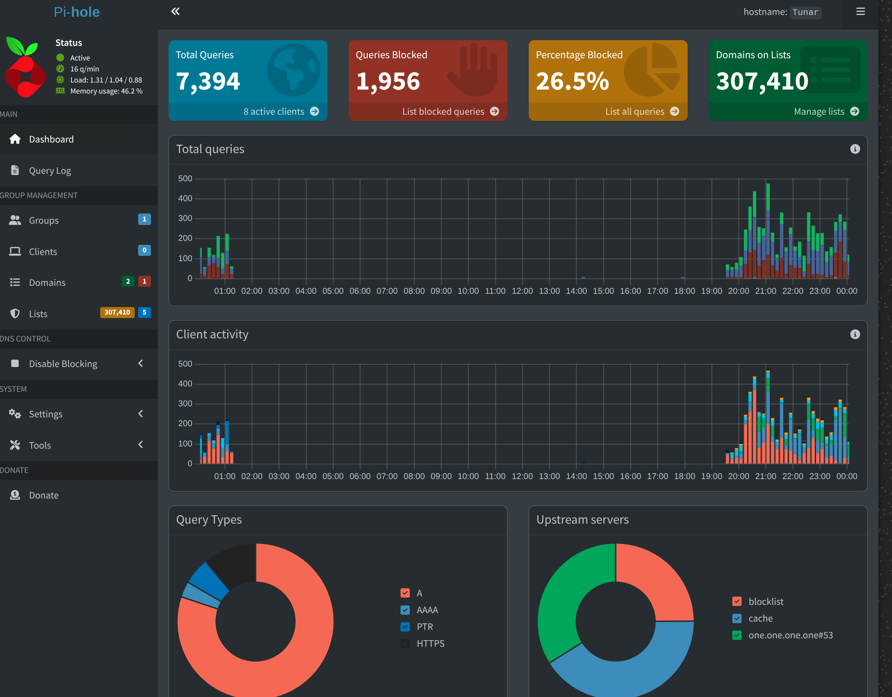
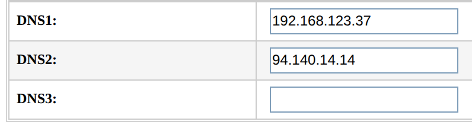
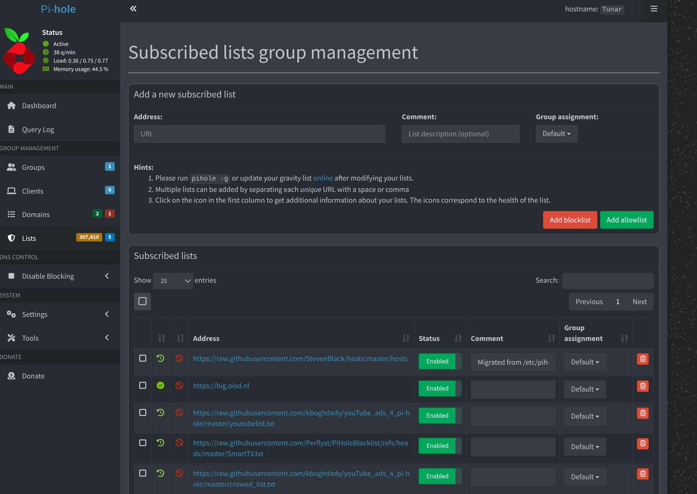

## Installation of Pi-hole on a Home WiFi Network
Pi-hole is a network-wide ad blocker that uses your existing DNS infrastructure. It blocks ads, trackers, malware, and other unwanted content at the DNS level, and it's very configurable and easy to use.


# Pi-hole Docker Setup

A simple and convenient Docker Compose setup for running Pi-hole on Ubuntu 24.04 LTS


This setup can also be configured into single-board devices like the Raspberry Pi Zero, Orange Pi Zero, and other single-board computers.

### Ubuntu 24.04 Installation (i was using ubuntu 24.04 LTS)

This setup is fully compatible with **Ubuntu 24.04 LTS** and has been tested to work correctly.

If you're using Ubuntu 24.04 LTS, install Docker and Docker Compose

## ⚡ Quick Start

1. **Clone or download** this repository

2. **Navigate** to the project directory:
   ```bash
   cd /path/to/pihole
   ```
3. **Make the script executable**:
   ```bash
   chmod +x pi.sh
   ```
4. **Verify Docker installation** (Ubuntu 24.04):
   ```bash
   docker --version
   docker compose version
   ```
5. **Start Pi-hole**:
   ```bash
   ./pi.sh start
   ```

That's it! Pi-hole will be running and accessible at `http://192.168.x.x/admin`

## 🛠️ Usage

The `pi.sh` script provides several convenient commands:

```bash
./pi.sh start    # Start Pi-hole
./pi.sh stop     # Stop Pi-hole
./pi.sh restart  # Restart Pi-hole
./pi.sh status   # Show Pi-hole status (default command)
./pi.sh web      # Open web interface in browser
./pi.sh password # Change admin password
```

### Web Interface Access



- **URL**: http://192.168.x.x/admin
- **Initial Password**: `your_password` (configured in docker-compose.yml)

**Important**: Change the default password after first login!

## ⚙️ Configuration

### DNS Setup



(I used my local ip as dns server)

1. **Router Configuration**: Set your router's DNS to `192.168.x.x`
2. **Device Configuration**: Alternatively, configure individual devices to use `192.168.x.x` as DNS
3. **Backup DNS**: Set a secondary DNS server (e.g., 94.140.14.14) in your router or device settings as a fallback 
### Changing Settings

You can modify the configuration in `docker-compose.yml`:

```yaml
environment:
  TZ: 'Your/Timezone'           # Change timezone
  WEBPASSWORD: "your_password"  # Change admin password
  SERVERIP: "192.168.x.x"    # Change if different IP needed
```


## 📋 Ad Block Lists



Pi-hole uses ad block lists (also known as blocklists or blacklists) to filter out unwanted domains, ads, trackers, and malicious sites. These lists are sourced from various repositories and can be customized to enhance your ad-blocking experience.

### How to Add Block Lists

1. **Access the Pi-hole Web Interface**: Visit `http://192.168.x.x/admin` in your browser and log in with your password.
2. **For Finding Lists**Click on the "Group Management" tab.
3. **For Adding Lists**In the "Group Management" tab, click on the "Lists" tab.
4. **Add New Lists**: Enter the URL of the block list in the "Add a new ad list" field and click "Add".
5. **Update Gravity**: After adding lists, use the web interface to update the lists. This will download the latest versions of the lists.

### Recommended Block Lists

Here are some popular lists i use:

| URL | Description |
|-----|-------------|
| https://raw.githubusercontent.com/StevenBlack/hosts/master/hosts | Comprehensive hosts file from Steven Black, blocks ads, trackers, and more. |
| https://big.oisd.nl | OISD Blocklist – focuses on ads, trackers, and malware. |
| https://raw.githubusercontent.com/kboghdady/youTube_ads_4_pi-hole/master/youtubelist.txt | YouTube-specific ad blocker. |
| https://raw.githubusercontent.com/Perflyst/PiHoleBlocklist/refs/heads/master/SmartTV.txt | Blocklist for Smart TVs and streaming devices. |
You can also view the full list that I use  in [addlist.txt](addlist.txt):


- **Test Changes**: After adding new lists, monitor your query log to ensure no legitimate sites are blocked.
- **Custom Lists**: You can create your own list by hosting a plain text file with domains (one per line) and adding its URL.
- **Update Regularly**: Pi-hole can automatically update lists, but you can force an update via the web interface or command line.
For more details visit the [Pi-hole Documentation](https://docs.pi-hole.net/).

## 📄 License

This project is open source and available under the [MIT License](LICENSE).

---

**Fuck ads!**

